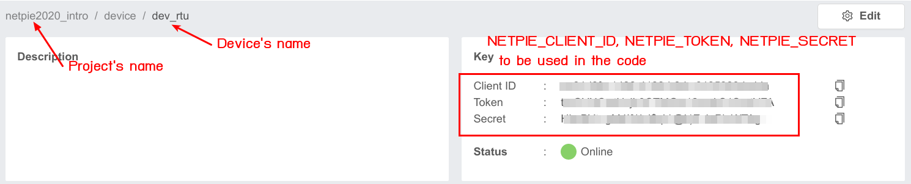
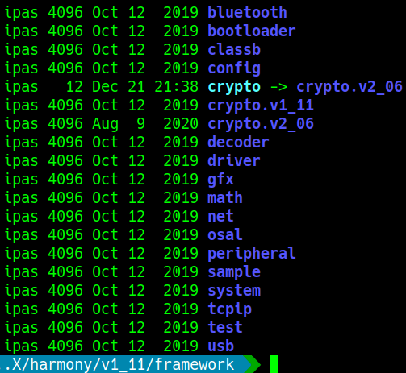
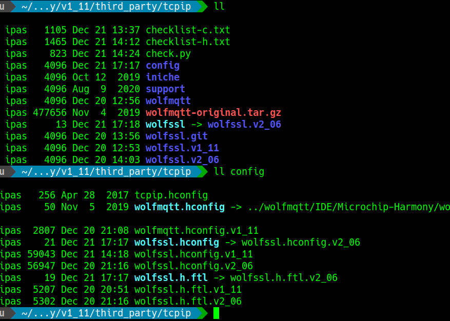

# NETPIE-2020 Interfacing Example on Universal Remote Terminal Unit (uRTU)

This is an example for [NETPIE-2020](https://netpie.io/) application 
    developed under PIC32MZ plus Microchip's Harmony  platform.
You can find the original version of this source code at 
    [AWS-IoT repository](https://github.com/MicrochipTech/aws-iot-firmware-pic32mz) 
    where the WolfMQTT library plays on top of the Network Presentation Layer (NET_PRES).
For further information, they could be found at the 
    [Microchip's Harmony v1 website](https://www.microchip.com/mplab/mplab-harmony/mplab-harmony-1.0).
Additionally, the device under test is named Universal Remote Terminal Unit, also called uRTU,
    which is a product of R&D lab inside [NECTEC](https://www.nectec.or.th) -- 
    [Intelligent SCADA Technology laboratory](https://www.nectec.or.th/research/research-unit/insrg-ist.html).

## Quick Setup

1) Use the Harmony v1 configurator to generate, or import at least,
    a new project from the following Harmony configuration file:
    - firmware/netpie_pic32mz.hconfig

2) Re-configure and re-generate the project with the configurator:
    - Name the first generated application code as __app_uart_term__.
    - Name the second generated application code as __app_mqtt_client__.

3) Copy these files and folder to your project:
    - firmware/src/app_mqtt_client.c (overwrite the existing)
    - firmware/src/app_mqtt_client.h (overwrite the existing)
    - firmware/src/app_uart_term.c   (overwrite the existing)
    - firmware/src/app_uart_term.h   (overwrite the existing)
    - firmware/src/netpie2020_config.h 
    - firmware/src/aux     

4) Add the following files into the project by their types 
    -- by right-clicking on the folders in Project Window:
    - Header:
        - firmware/src/netpie2020_config.h
        - firmware/src/aux/parson.h
    - Source:
        - firmware/src/aux/parson.c

5) Get your NETPIE-2020 device's configuration from the dash board as shown below, 
    then revise the file __firmware/src/netpie2020_config.h__.

6) In your own generated application, follow the example 
    as leading in __firmware/src/app_tester.c__.

## Related Contributions

* [JSON parsing library](http://kgabis.github.com/parson/)

## Libraries

### Installation

1. WolfMQTT

    * third-party/tcpip/wolfmqtt -> 2.06

2. WolfSSL

    * framework/crypto -> 2.06 

    

    * third-party/tcpip/config -> revised 2.06
    * third-party/tcpip/wolfssl -> revised 2.06 

    

3. Harmony v1.11 Configuration
    * Crypto
    * WolfMQTT
    * WolfSSL

### Notes

* [SSL vs TLS - What's the Difference?](https://www.globalsign.com/en/blog/ssl-vs-tls-difference)
* [ความแตกต่างของ TLS กับ SSL](https://netway.co.th/kb/ssl-certificate/%E0%B8%82%E0%B9%89%E0%B8%AD%E0%B8%A1%E0%B8%B9%E0%B8%A5%E0%B8%97%E0%B8%B1%E0%B9%88%E0%B8%A7%E0%B9%84%E0%B8%9B/%E0%B8%84%E0%B8%A7%E0%B8%B2%E0%B8%A1%E0%B9%81%E0%B8%95%E0%B8%81%E0%B8%95%E0%B9%88%E0%B8%B2%E0%B8%87%E0%B8%82%E0%B8%AD%E0%B8%87-tls-%E0%B8%81%E0%B8%B1%E0%B8%9A-ssl)
